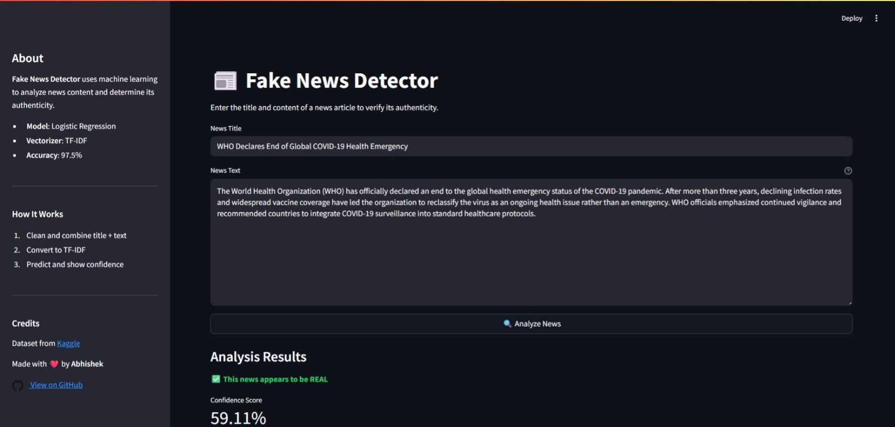

[](https://fakenewsdetector-nawseekhiya.streamlit.app/)

This is a personal project — open for learning and contributions, but **all rights are reserved**. See [LICENSE](LICENSE) for details.

# 📰 Fake News Detector

A Machine Learning–powered web application that detects whether a news article is **real or fake**. Built using Python, Scikit-learn, and Streamlit, the app takes the **title and content** of a news piece, processes it using NLP, and returns the probability of it being fake or real.



---

## 🚀 Features

- 🔍 Real-time news authenticity classification
- 📚 Pretrained Logistic Regression model with TF-IDF vectorization
- 🧠 NLP preprocessing: cleaning, tokenization, stopword removal, lemmatization
- 📊 Streamlit frontend for interactive user experience
- 💬 Confidence score and detailed probability breakdown
- 🧪 Reproducible and modular ML pipeline

---

## 🧰 Technologies Used

| Technology         | Description                                                  |
|--------------------|--------------------------------------------------------------|
| **Python 3.10+**    | Core programming language                                    |
| **Streamlit**       | Web application framework for interactive ML dashboards     |
| **Scikit-learn**    | Machine learning model and vectorization (TF-IDF + Logistic Regression) |
| **Pandas**          | Data manipulation and loading                               |
| **NLTK**            | Natural language processing (tokenization, stopword removal, lemmatization) |
| **Joblib**          | Model serialization and loading                             |

---

## 📦 Project Structure

```bash
├── app/
│   └── streamlit_app.py         # Streamlit web interface
├── data/                        # 🔒 Exported raw and processed data (ignored in Git)
│   ├── raw/                     # Raw news dataset
│   └── processed/               # Cleaned & tokenized data used for training
├── models/
│   └── fake_news_model.pkl      # Serialized model with TF-IDF + classifier
├── notebooks/
│   ├── 01_eda_analysis.ipynb
│   ├── 02_data_preprocessing.ipynb
│   ├── 03_train_model.ipynb
│   ├── 04_test_model.ipynb
│   ├── 05_evaluate_model.ipynb
│   └── 06_realtime_inference.ipynb
├── scripts/
│   ├── data_processing.py       # Preprocess and export data to /data
│   ├── train_model.py           # Model training and serialization
│   ├── test_model.py            # Testing and validation
│   ├── evaluate_model.py        # Evaluation metrics and plots
│   └── predict.py               # Inference module for real-time prediction
├── .gitignore                   # Excludes /data/, /.venv/, etc.
├── requirements.txt            # All project dependencies
├── README.md                   # Documentation
└── .venv/                      # 🔒 Local Python virtual environment (ignored in Git)
````
> 🔒 Note: The `/data` folder is used for storing raw and processed files after preprocessing,
> but it is `.gitignore`-d to avoid large data commits. Similarly, `.venv/` is ignored for local virtual environments.

---

## 📦 Requirements

### 🔧 Core Requirements (App + Inference)

| Package        | Version | Purpose                                                     | Notes                           |
| -------------- | ------- | ----------------------------------------------------------- | ------------------------------- |
| `streamlit`    | 1.32.0  | Frontend web app UI                                         | Used in `streamlit_app.py`      |
| `scikit-learn` | 1.4.2   | Model training + inference                                  | Core ML library                 |
| `pandas`       | 2.2.1   | Data handling                                               | Used throughout pipeline        |
| `numpy`        | 1.26.4  | Numerical operations                                        | Backend for many ML processes   |
| `datasets`        | 2.18.0  | Loading datasets from Hugging Face | Used in `data_processing.py`        |
| `kagglehub`       | 0.2.1   | Downloading datasets from Kaggle   | Loads dataset automatically              |
| `nltk`         | 3.8.1   | Text preprocessing (tokenization, stopwords, lemmatization) | Used in `data_processing.py`    |
| `joblib`       | 1.3.2   | Model serialization                                         | Saving + loading models         |
| `pathlib`      | 1.0.1   | Filesystem path management                                  | Used in scripts + Streamlit app |

### 📊 EDA-Only Requirements

| Package           | Version | Purpose                            | Notes                                |
| ----------------- | ------- | ---------------------------------- | ------------------------------------ |
| `matplotlib`      | 3.8.2   | Data visualization                 | Used in Jupyter notebooks only       |
| `seaborn`         | 0.13.2  | Statistical visualizations         | EDA enhancement                      |
| `wordcloud`       | 1.9.3   | Visualizing most frequent words    | Word cloud generation                |
| `tqdm`            | 4.66.2  | Progress bars                      | Nice-to-have UX feature in notebooks |
| `python-dateutil` | 2.9.0   | Date parsing                       | Possibly transitive (from pandas)    |
| `tzdata`          | 2024.1  | Timezone info                      | Possibly transitive                  |

---

## 🛠️ Setup Instructions

### 1. Clone the Repository

```bash
git clone https://github.com/nawseekhiya/fake-news-detector.git
cd fake-news-detector
```

### 2. Set Up a Virtual Environment

```bash
python -m venv .venv
source .venv/bin/activate       # On Windows: .venv\Scripts\activate
```

### 3. Install Dependencies

```bash
pip install -r requirements.txt
```

### 4. Run the Application

```bash
streamlit run app/streamlit_app.py
```

Visit `http://localhost:8501` in your browser to use the app.

_🔍 Optional: To explore EDA notebooks, make sure `matplotlib`, `seaborn`, and `wordcloud` are installed (included in requirements.txt)._

---

## 🧠 Model Details

* **Model:** Logistic Regression
* **Vectorizer:** TF-IDF with bi-grams
* **Accuracy:** 97.5% on test set
* **Input:** Combined string of title + article body

---

## 🗃️ Dataset

Dataset sourced from Kaggle:
👉 [Fake and Real News Dataset](https://www.kaggle.com/datasets/clmentbisaillon/fake-and-real-news-dataset)

---

## 🌿 Branching Strategy

| Branch       | Purpose                        |
| ------------ | ------------------------------ |
| `main`       | Production-ready code          |
| `feat/*`     | New features                   |
| `fixes/*`    | Bug fixes                      |
| `docs/*`     | Documentation improvements     |

---

## 🤝 Contributing

1. Fork the repository
2. Create your feature branch: `git checkout -b feat/your-feature-name`
3. Commit your changes: `git commit -m 'Add new feature'`
4. Push to the branch: `git push origin feat/your-feature-name`
5. Open a Pull Request with a clear PR template and linked issue

We follow **conventional commit rules** and **issue-linked PRs** for clean history and CI-friendly development.

---

## 🙋 FAQ

**Q:** Why do we combine title + text for prediction?
**A:** This aligns with how the model was trained — on combined textual features from both fields.

**Q:** Is this suitable for production?
**A:** This is a prototype. While the ML pipeline is effective, it needs containerization, monitoring, and better error handling before production use.

---

## 📄 License

This project is **open-sourced with restrictions**.

- All rights are reserved by the core team.
- You are free to use or adapt the code, but **must credit the original authors**.
- Contributions are welcome and will be **acknowledged**, but do not grant ownership or redistribution rights.
- Redistribution or commercial use without explicit permission is **not allowed**.
- You may not use the code in any way that could be considered **derivative** or **commercial** without explicit permission from **Abhishek Mohanty**.  
  Read more at [LICENSE.md](./LICENSE.md).

---

## ✨ Credits

* Made with ❤️ by [Abhishek](https://github.com/nawseekhiya)
* Dataset: [Kaggle - Fake and Real News Dataset](https://www.kaggle.com/datasets/clmentbisaillon/fake-and-real-news-dataset)

---
